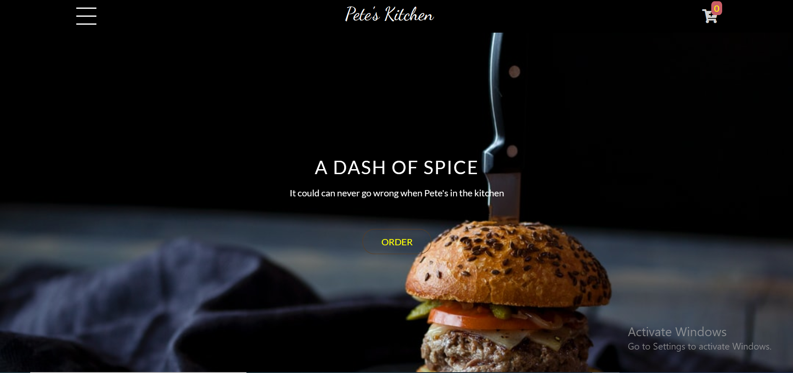

# TechConf Capstone Project
This is a responsive food-ordering website. Users can select, and order whatever food is on the menu for the day. 
The site captures a users orders and sends it directly to the kitchen's email. The kitchen can then call back the user to make any clarifications and arrangements required.

## Bult With

- HTML 5
- CSS 3
- Javascript

## Getting Started

No prerequisites

To get a local copy:

- Cloning repository:

    1. Press the green button "Code" and copy the link.
    2. Open terminal or Git Bash in a folder where you want to clone the repository.
    3. Type the command `git clone https://github.com/blakbox23/Summit-responsive-website.git` and press "Enter"
    4. Find the "index.html" file and double click on it to display the project.

- Downloading zip file:

   1. Press the green button "Code" and press "Download ZIP"
   2. Save the file and extract it in any folder you wish
   3. Find the "index.html" file and double click on it to display the project.

## Live Demo

[Live Demo Link](https://blakbox23.github.io/pete-s_kitchen/)

## Authors
- GitHub: [@Blakbox23](https://github.com/blakbox23)
- Twitter: [@blakbox23](https://twitter.com/blakbox23)
- LinkedIn: [Peter Mbuthia](https://www.linkedin.com/in/peter-mbuthia)

## 🤝 Contributing

Contributions, issues, and feature requests are welcome!

Feel free to check the [issues page](https://github.com/blakbox23/pete-s_kitchen/issues/).

## Show your support

Give a ⭐️ if you like this project!

## Acknowledgments

- My learning partners and stand up team
- unsplash.com

## 📝 License

This project is [MIT](https://github.com/git/git-scm.com/blob/master/MIT-LICENSE.txt) licensed.

